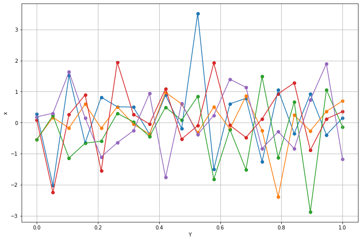
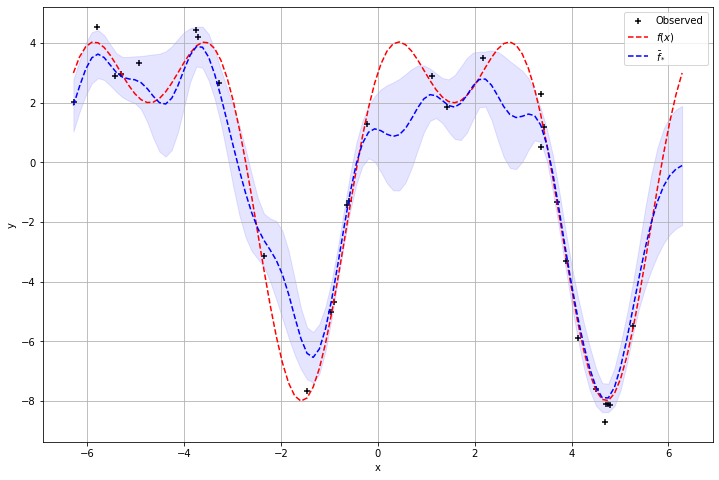

# Gaussian Process Regression

The following is a brief overview of Gaussian process regression, the [GPR_Theory](GPR_Theory.ipynb) notebook contains a step by step implementation of GP regression following Algorithm 2.1 on p19 of [Gaussian Processes for Machine Learning](https://gaussianprocess.org/gpml/). The [GPR](GPR.ipynb) notebook contains roughly the same information, but uses the custom [gpr](gpr/gpr.py) module which contains all the functions and methods required for perform Gaussian process regression, and takes inspiration from the [Scikit-learn implementation](https://scikit-learn.org/stable/modules/generated/sklearn.gaussian_process.GaussianProcessRegressor.html) of GPR.

## Introduction

A Gaussian Process defines a distribution over functions that fit a set of observed data. We can loosely think of a function in continuous space as a vector of infinite length containing the function values $f(x)$ at each $x$.

In practice, we rarely need the infinitely many outputs. Instead, we only care about a finite number of outputs. Luckily, inference in Gaussian processes provides the same function outputs regardless of the number of points [1].

## Multivariate Gaussian Distribution
First, a quick recap of the Multivariate Normal (or MVN):

The MVN is given by

$$\mathcal{N}(x | \mu, \Sigma) = \frac{1}{(2\pi)^{D/2}|\Sigma|^{1/2}} \exp \left[-\frac{1}{2}(x-\mu)^T(x-\mu) \right]$$

Where $x$ is a $D$-dimensional variable, $\mu = \mathbb{E}(x) \in \mathbb{R}^D$ is the mean vector and $\Sigma = \text{cov}[x] \in \mathbb{R}^{DxD}$ is the covariance matrix.

The figure below shows 5 samples drawn from a 20-variate Normal distribution, with zero mean and identity covariance spaced evenly over the range $y=[0, 1]$.

  

Connecting the entries of each sampled vector illustrates how the 20-dimensional vector can resemble a function. However, the choice of identity covariance causes the produced 'function' to appear noisy and unsmooth.

## Kernels

To smooth the outputs of the MVN, we can use a function to control the covariances, i.e. a _covariance function_. One would expect similar inputs (inputs that are close together) to produce similar outputs, i.e. for a small change in $x$ we expect to see a small change in $y$. One of the more commonly used kernel functions is the squared exponential function, or the Radial Basis Function, given by

$$ RBF(x_i, x_j) = \sigma_f^2 \exp \left[ - \frac{1}{2}\frac{(x_i - x_j)^2}{l^2} \right] $$

Where $\sigma_f$ is a hyperparameter that determines the vertical span of the kernel outputs and $l$ is the length scale that determines how much the distance between 2 points affects their correlation. (Refer to Figure 2.5 on p.20 of [1] for a visual example of the effects of varying $l$)

## Gaussian Process Regression

As mentuioned before, a Gaussian Process models a distribution over functions that fit a set a observed data. The mean of this distribution is the function used for regression purposes, and is given by

$$ P(\mathbf{f}|\mathbf{X}) = \mathcal{N}(\mathbf{f}| \mathbf{\mu}, \mathbf{K})$$

Where $\mathbf{X} = [x_1, \dots, x_n ]$, $\mathbf{f}=[f(x_1),\dots, f(x_n)]$, $\mathbf{\mu} = [m(x_1), \dots, m(x_n)]$ and $K_{ij} = k(x_i, x_j)$. Here, $m$ represents the mean function and $k$ the positive definite kernel function [2]

Without any observations, the mean is assumed to be $\mathbf{\mu} = \mathbf{0}$ (i.e. the prior distribution). By taking the observations $\mathbf{f}(\mathbf{X})$ at locations $\mathbf{X}$ into account, we update the posterior distribution, of which the mean is the regression function $\mathbf{\bar{f}}$, which we can then use to make new predictions $\mathbf{f}(\mathbf{X_*})$ at $\mathbf{X_*}$. From here on, the shorthand $\mathbf{f}$ and $\mathbf{f_*}$ will be used to refer to $\mathbf{f}(\mathbf{X})$ and $\mathbf{f}(\mathbf{X_*})$ respectively.

The join distribution of $\mathbf{f}$ and $\mathbf{f_*}$, $P(\mathbf{f}, \mathbf{f_*}| \mathbf{X}, \mathbf{X_*})$, is given by

$$\begin{bmatrix}
\mathbf{f}\\
\mathbf{f_*}
\end{bmatrix}  \sim \mathcal{N} \left( \mathbf{0},
\begin{bmatrix}
\mathbf{K} & \mathbf{K_*}\\
\mathbf{K_*}^T & \mathbf{K_{**}}
\end{bmatrix} 
\right)$$

Where $\mathbf{K} = K(\mathbf{X}, \mathbf{X})$, $\mathbf{K_*} = K(\mathbf{X}, \mathbf{X_*})$ and similarly $\mathbf{K_{**}} = K(\mathbf{X_*}, \mathbf{X_*})$.

For regression purposes, we require the conditional distribution $P(\mathbf{f_*}| \mathbf{f}, \mathbf{X}, \mathbf{X_*})$, the derivation of which can be found in Section A.2 of [1]. The conditional distribution is given by

$$
\mathbf{f_*}| \mathbf{f}, \mathbf{X}, \mathbf{X_*}  \sim \mathcal{N}\left(\mathbf{K_*}^T \mathbf{K}^{-1} \mathbf{f}, \mathbf{K_{**}} - \mathbf{K_*}^T \mathbf{K}^{-1} \mathbf{K_*}\right)
$$

In practice, measurements often include some noise, i.e. $y = f(x) + \epsilon$. If we assume $\epsilon$ to be zero mean, additive, independent and identically distributed (iid) Gaussian noise with a variance of $\sigma_n^2$, the prior covariance becomes

$$\text{cov}(\mathbf{y}) = K(\mathbf{X}, \mathbf{X}) + \sigma_n^2 I$$

And we replace the respective block in the covariance matrix of the joint distribution with the new formulation. This leads to the new predictive equations for Gaussian process regression

$$
\mathbf{f_*} = \mathbb{E}[\mathbf{f_*} | \mathbf{y}, \mathbf{X}, \mathbf{X_*}] = \mathbf{K_*}^T [\mathbf{K} + \sigma_n^2 I]^{-1} \mathbf{y} \\
\text{cov}(\mathbf{f_*}) = \mathbf{K_{**}} - \mathbf{K_*}^T [\mathbf{K} + \sigma_n^2 I]^{-1} \mathbf{K_*}
$$

The figure below shows an example of GP regression using the squared exponential kernel, the shaded blue area denotes 2 standard deviations.

  

## References

[1]  C. E. Rasmussen, C. K. I. Williams, Gaussian Processes for Machine
Learning, The MIT Press, 2006.

[2]  J. Wang, An Intuitive Tutorial to Gaussian Processes Regression, arXiv:2009.10862, 2020.

[3] Scikit-learn: Machine Learning in Python, Pedregosa et al., JMLR 12, pp. 2825-2830, 2011

[4] API design for machine learning software: experiences from the scikit-learn project, Buitinck et al., 2013